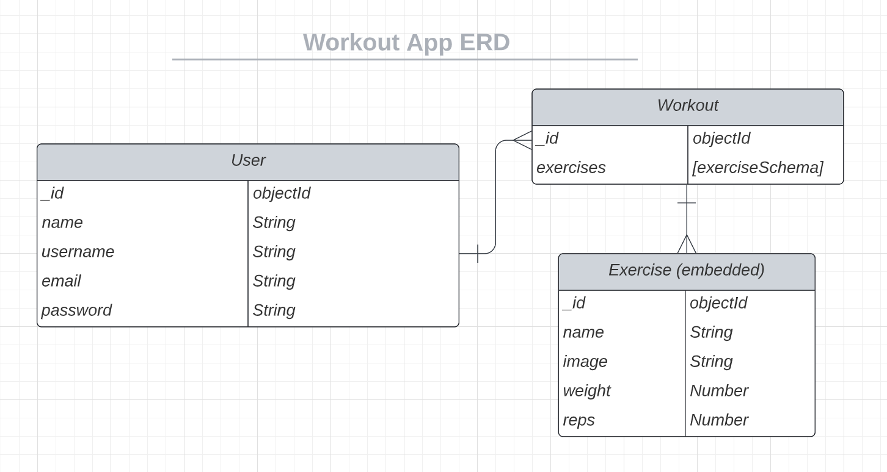
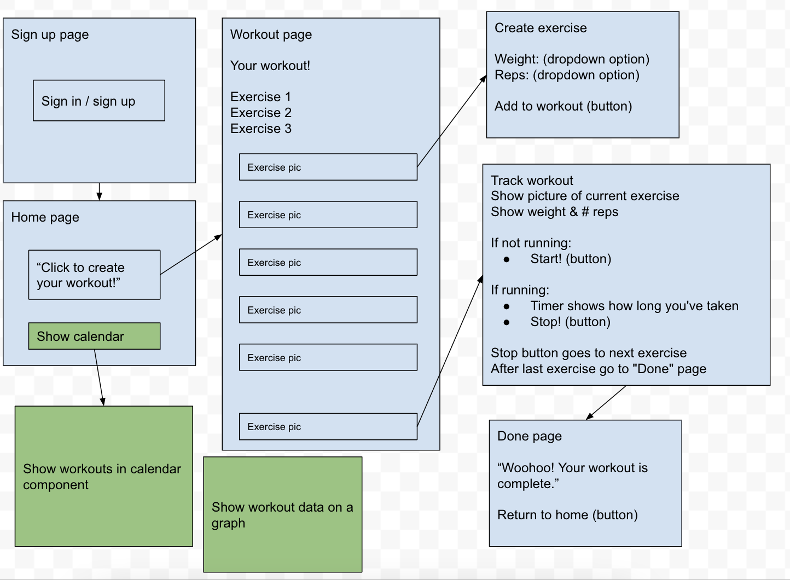
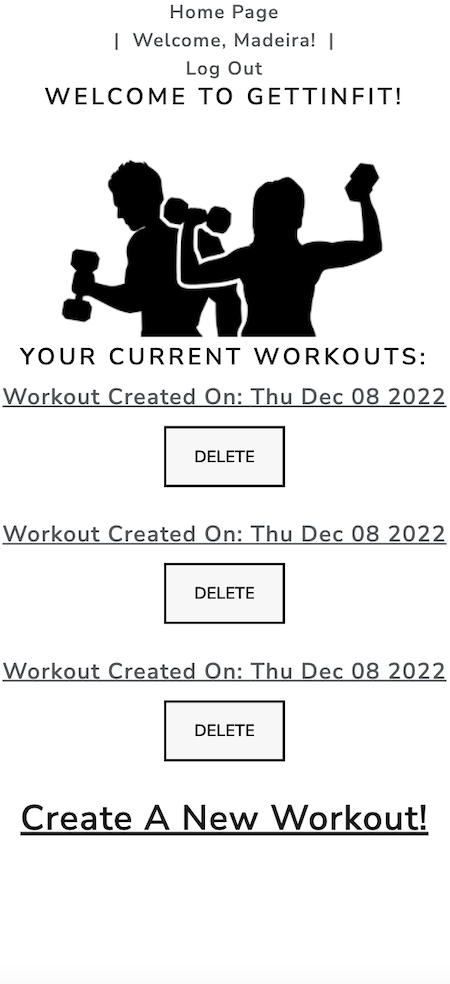
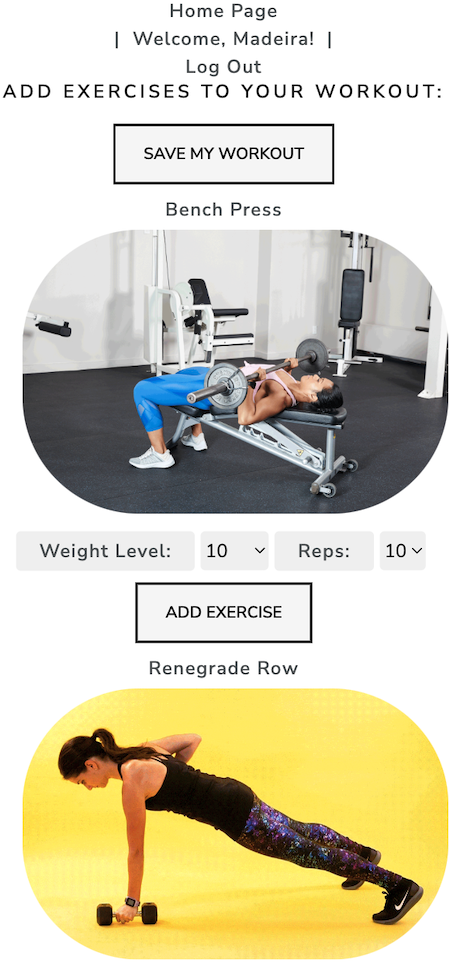
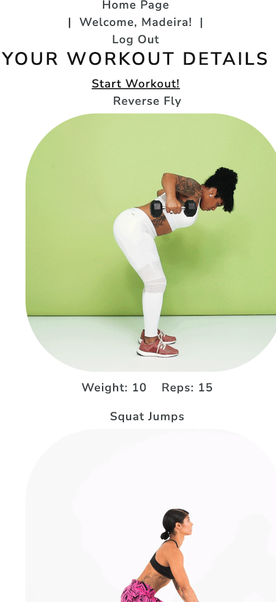
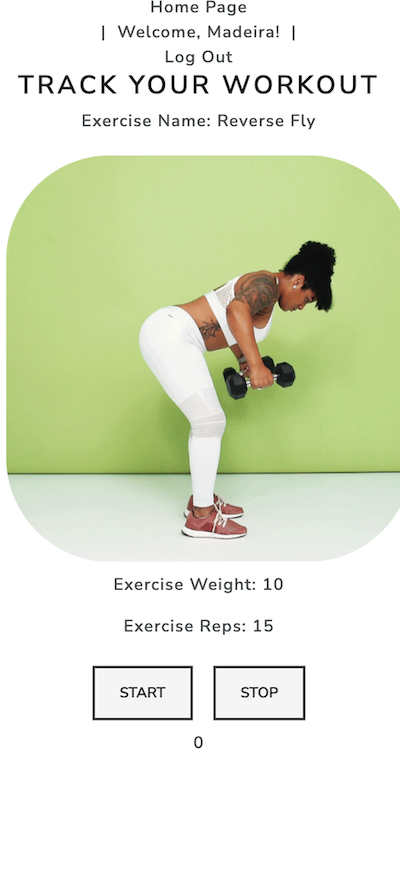

# Project 3: MERN-Stack Workout App, GettinFit :muscle:

# About GettinFit:
Exercising is crucial in keeping the mind and body healthy. However, for many, motivating oneself to actually getting up and moving the body can be difficult (even for myself at times). This app is here to take a bit of that stress away.

With GettinFit, you can create your own workout -- to however many (or little) exercises you want. Scroll through different exercise options, add them to your workout for the day, then track your workout with a timer. You can delete a workout if you ended up not liking it, too.

## ERD & Wireframe

## Screenshots

## Technologies Used
1. MERN Stack
    - Mongoose & MongoDB Online Web Server
    - Express.js
    - React
    - Node.js

2. Ajax
3. JWT
4. JavaScript
5. HTML
6. CSS
7. Bootstrap
8. Lucidchart
9. Trello: https://trello.com/b/QeTKrZEV/project-3-workout-app

## GettinFit App:
https://gettinfit.herokuapp.com/

## Next Steps
1. Create a calendar to show which days you created your workouts on.
2. Build a graph to display the user's workout data to add as an extra visual. This will help the user see patterns in their workout routines, and hopefully influence future workouts.
3. Add more styling.